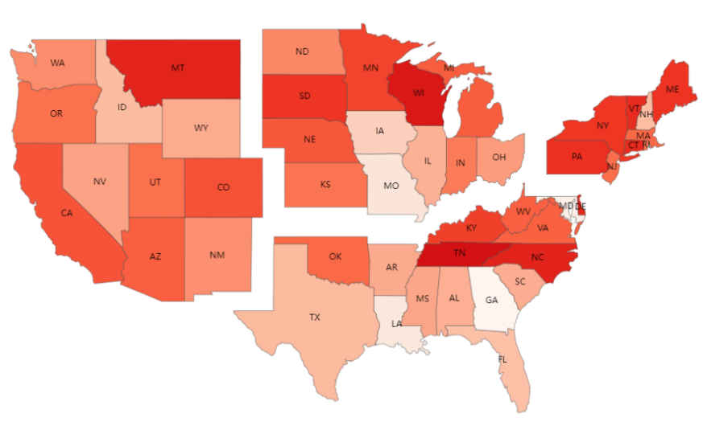

# 画图说明

效果图

# 文件说明
1. process_map.py

**处理画图所需要的数据**

输入：
（1）'data/USA.json'地图原始数据；
（2）twitter_mapData.csv和state360_mapData.csv两个数据文件

功能：
（1）将'data/USA.json'中的州的全称变成简写，并按照机构划分，给每个州不同的偏移量；
（2）处理获得画图需要的数据twitter_local/Integrated/Centralized.jason 和 state360_local/Integrated/Centralized.jason

2. USAmap.html

**画图文件**

