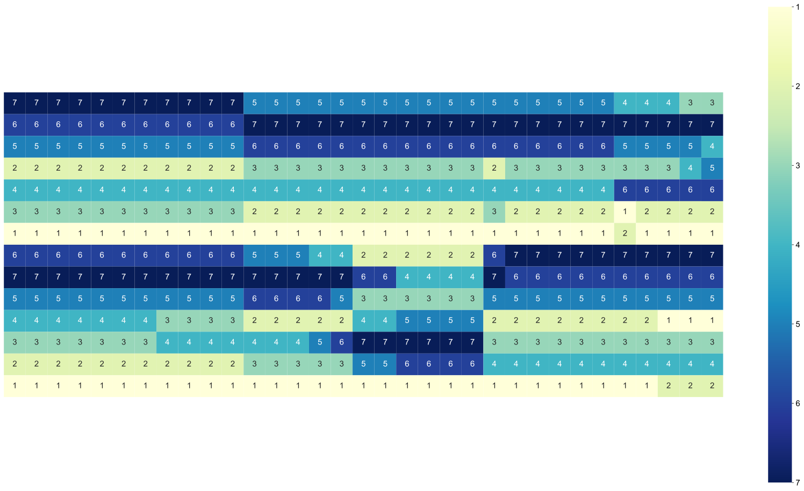

# 用于记录画图的代码

# Tools
该文件夹中存放一些常用的实用代码

# CNL

## 1. fig_half_heatmap.ipynb

## 2. plot_bar

## 3. USAmap.html

### 文件说明
* process_map.py

**处理画图所需要的数据**

输入：
（1）'data/USA.json'地图原始数据；
（2）twitter_mapData.csv和state360_mapData.csv两个数据文件

功能：
（1）将'data/USA.json'中的州的全称变成简写，并按照机构划分，给每个州不同的偏移量；
（2）处理获得画图需要的数据twitter_local/Integrated/Centralized.jason 和 state360_local/Integrated/Centralized.jason

* USAmap.html画图文件

# VE

## 1. plot_stackBar.py

# HiGCN

## 1. plot_bar_stack.py

# HiMnet

## plot_group_stack_bar.oy

## line_graph_for_figeys.py

## plot_correlation_bar_0.py

PS:中间的缝缝需要自己拉

